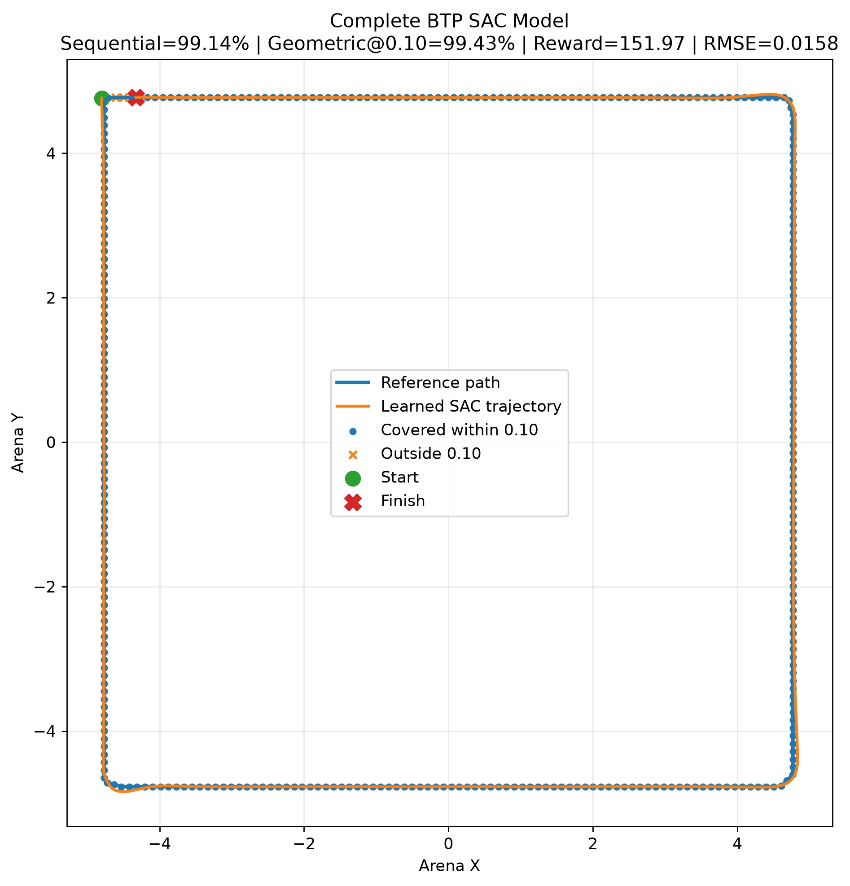
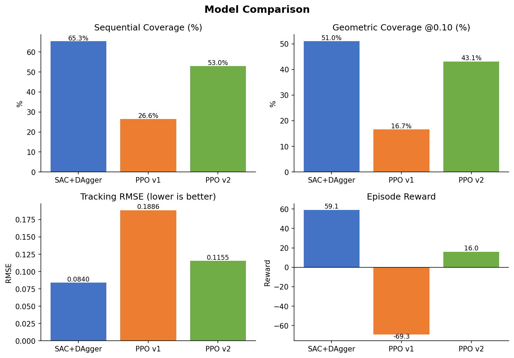

# Reinforcement Learning for Autonomous Bead Path Tracing

A faculty-supervised B.Tech research project on **continuous-control reinforcement learning for tracing closed contours extracted directly from raster images**.

The project began with a single-contour PPO baseline that appeared successful on its training shape but failed to transfer. That failure motivated a stricter geometric evaluation protocol, a procedurally generated multi-shape curriculum, and a final **Soft Actor-Critic (SAC) + Dataset Aggregation (DAgger)** actor-refinement pipeline.

> **Project status:** model development and experimental evaluation are complete; the research manuscript is in preparation.



## Main result

On a deliberately out-of-distribution circular probe, the archived experiment artifacts report:

| Training/controller pipeline | Sequential coverage | Geometric coverage @ 0.10 | Tracking RMSE |
| --- | ---: | ---: | ---: |
| Single-shape PPO | 26.55% | 16.66% | 0.1886 |
| Multi-shape PPO | 53.01% | 43.14% | 0.1155 |
| **SAC + DAgger** | **65.33%** | **50.99%** | **0.0840** |

These are **pipeline comparisons, not a clean algorithm-only SAC-vs-PPO ablation**. The historical PPO experiments use a 25-D paper-inspired observation/reward design, while the SAC pipeline uses a 16-D observation and a different reward. For that reason, geometric metrics and RMSE are the appropriate cross-pipeline comparison; episode rewards are not directly comparable. See [`docs/reproducibility_audit.md`](docs/reproducibility_audit.md).



## What was built

### 1. Image-to-contour environment

A custom 2-D point-mass environment converts a raster image into an ordered reference path and simulates acceleration-bounded bead dynamics. The contour pipeline supports thin strokes and filled shapes through:

- image resizing, grayscale conversion, Gaussian blur, and Otsu thresholding;
- automatic foreground-polarity selection from border intensity;
- morphology plus Zhang-Suen thinning for stroke-like inputs;
- OpenCV contour extraction as a fallback / filled-shape path;
- arena-coordinate mapping and uniform arc-length resampling;
- explicit path breaks so disconnected components are not bridged by reward or metric calculations.

The final SAC environment exposes a **16-dimensional observation** containing local waypoint geometry, normalized position/velocity, heading, curvature, look-ahead direction, path distance, on-curve state, and progress. The action is a 2-D continuous acceleration command.

### 2. Dual coverage evaluation

The original waypoint-index metric can report progress even when the trajectory cuts away from the true curve. The project therefore reports both:

- **Sequential coverage:** furthest sequential waypoint progress; and
- **Geometric coverage:** fraction of reference-path points lying within a tolerance of the *entire rollout polyline*, computed with point-to-segment projection while respecting disconnected path breaks.

Tracking RMSE is computed in the reverse direction from rollout samples to the reference polyline. The implementation lives in [`src/bead_rl/metrics.py`](src/bead_rl/metrics.py).

### 3. Three experimental pipelines

**Single-shape PPO.** A paper-inspired PPO controller trained on one reference contour. It obtains strong in-distribution progress but exhibits severe transfer failure on the OOD probe.

**Multi-shape PPO.** The same historical PPO controller family trained with a fresh contour sampled at episode reset from a **1,000-image procedural dataset** (700 train / 150 validation / 150 test). The best archived validation-selected checkpoint is at **5,400,004 timesteps**; the earlier ~3M and later ~5.7M checkpoints are preserved separately.

**SAC + DAgger.** A 30k-step off-policy SAC base policy is refined with actor-only DAgger. A hand-coded waypoint-following expert labels states visited by the learner; expert mixing decays over successive rounds while the aggregated dataset grows. Model selection prioritizes geometric coverage over the more gameable sequential metric.

## Verified archived results

| Benchmark | Model | Sequential | Geom. @ 0.10 | RMSE | Notes |
| --- | --- | ---: | ---: | ---: | --- |
| Training square, 20 eps | SAC+DAgger | 98.27% | 95.59% | 0.0325 | Standalone archived evaluation |
| OOD circle, 20 eps | SAC+DAgger | 65.33% | 50.99% | 0.0840 | Scale/framing shift |
| Hollow star, 20 eps | SAC+DAgger | 86.25% | 71.64% | 0.0608 | Sharp convex/concave vertices |
| OOD circle, 20 eps | Multi-shape PPO | 53.01% | 43.14% | 0.1155 | Best archived checkpoint (~5.4M steps) |
| OOD circle, 20 eps | Single-shape PPO | 26.55% | 16.66% | 0.1886 | Historical aggregate preserved from log |

A separate six-shape procedural batch artifact reports **99.1–100% sequential coverage** for triangle, ellipse, rotated square, pentagon, square, and circle samples. Those values are intentionally not presented as geometric coverage; the original batch utility only displayed waypoint/sequential coverage.

Raw and normalized result provenance is under [`results/`](results/) and summarized in [`results/experiment_registry.csv`](results/experiment_registry.csv).

### Fresh clean-environment reproduction

A fresh Windows / Python 3.11.5 run using the pinned reproducibility stack passed **15/15 tests**, verified all **7 checkpoint hashes** and all **1,000 dataset images**, and executed the archived checkpoints end-to-end. The reproduced OOD-circle metrics were:

| Pipeline | Sequential | Geom. @ 0.10 | RMSE | Comparison with archive |
| --- | ---: | ---: | ---: | --- |
| SAC + DAgger | 65.33% | 50.99% | 0.0840 | Essentially exact match |
| Single-shape PPO | 26.55% | 16.66% | 0.1886 | Essentially exact match |
| Multi-shape PPO | 70.07% | 44.81% | 0.1130 | Geometry/RMSE close; sequential differs |

The multi-shape PPO sequential-coverage discrepancy is intentionally **not hidden or averaged away**. Sequential coverage is based on waypoint-index advancement and was already identified in this project as a sensitive/gameable metric; the stricter geometric coverage and RMSE remain close to the archived result. Both the historical aggregate and the clean reproduction are preserved for auditability. See [`results/windows_py311_reproduction_2026-10-08.json`](results/windows_py311_reproduction_2026-10-08.json) and [`VERIFICATION.md`](VERIFICATION.md).

## Repository layout

```text
.
├── src/bead_rl/                 # Environment, metrics, PPO legacy MDP, DAgger
├── scripts/                     # Training, refinement, evaluation, dataset tools
├── configs/                     # Recovered/verified experiment configurations
├── data/
│   ├── benchmarks/              # Square, OOD circle, hollow-star inputs
│   └── closed_shapes_dataset/   # Exact archived 700/150/150 procedural split
├── models/                      # Archived checkpoints + SHA-256 metadata
├── results/                     # Verified summaries and preserved raw artifacts
├── assets/                      # Figures used for project presentation
├── tests/                       # Core geometry/environment/artifact tests
└── docs/                        # Audit, provenance, manuscript corrections
```

## Installation

Python 3.11+ is recommended.

```bash
python -m venv .venv
# Linux/macOS
source .venv/bin/activate
# Windows PowerShell
# .venv\Scripts\Activate.ps1

pip install -e ".[dev]"
pytest
```

For the closest available reconstruction of the final archived software stack, use:

```bash
pip install -r requirements-repro.txt
```

The checkpoint archives record NumPy 2.1.3, Gymnasium 1.3.0, Stable-Baselines3 2.9.0, and PyTorch 2.11.0 for the final SAC+DAgger model. Historical OpenCV/Matplotlib versions were not embedded in the checkpoint, so they cannot be pinned exactly from the archive.

## Evaluate archived checkpoints

Evaluate the final SAC+DAgger policy on the OOD circle:

```bash
python scripts/evaluate_checkpoint.py \
  --algorithm sac \
  --model models/sac_dagger_final.zip \
  --image data/benchmarks/ood_circle.jpg \
  --episodes 20 \
  --out-prefix results/generated/sac_dagger_ood_circle
```

Compare all three archived pipelines:

```bash
python scripts/compare_checkpoints.py \
  --image data/benchmarks/ood_circle.jpg \
  --episodes 20
```

Render an individual rollout or regenerate comparison figures:

```bash
python scripts/visualize_trajectory.py \
  --algorithm sac \
  --model models/sac_dagger_final.zip \
  --image data/benchmarks/ood_circle.jpg \
  --out results/generated/sac_ood_trace.png

python scripts/plot_ood_comparison.py
```

Verify the preserved checkpoint and dataset hashes without any RL dependencies:

```bash
python scripts/verify_artifacts.py
```

## Training / reconstruction

The original **from-scratch SAC training script was not present in the archived working folder**. [`scripts/train_sac_base.py`](scripts/train_sac_base.py) is therefore a transparent reconstruction from the archived `sac_base_95.zip` metadata plus the historical project notes. It reproduces the known architecture and hyperparameters, but it is not claimed to be the missing original source file.

```bash
python scripts/train_sac_base.py \
  --image data/benchmarks/training_square.jpeg \
  --out models/generated_sac_base

python scripts/refine_sac_dagger.py \
  --image data/benchmarks/training_square.jpeg \
  --base models/generated_sac_base.zip \
  --out models/generated_sac_dagger
```

Historical PPO pipelines:

```bash
python scripts/train_ppo_single.py \
  --image data/benchmarks/training_square.jpeg

python scripts/train_ppo_multishape.py \
  --train-dir data/closed_shapes_dataset/train \
  --val-dir data/closed_shapes_dataset/val
```

## Procedural dataset

The exact 1,000 images used in the archived multi-shape experiment are preserved because the original generator did **not** persist its random seed. Their split counts and aggregate SHA-256 digests are recorded in [`data/closed_shapes_dataset/DATASET_METADATA.json`](data/closed_shapes_dataset/DATASET_METADATA.json).

For future deterministic experiments, generate a new seeded dataset with:

```bash
python scripts/generate_closed_shapes.py \
  --output data/generated_closed_shapes \
  --seed 2026
```

Do not treat a newly generated seeded dataset as byte-identical to the archived experimental split.

> **Legacy PPO checkpoint note:** the original PPO archives serialized a custom feature extractor from a ``__main__`` training script. Use the repository evaluation scripts (which apply the compatibility loader) rather than calling ``PPO.load(...)`` directly on those historical files.

## Reproducibility and scientific caveats

This repository intentionally preserves important historical behavior rather than silently changing the experiment after the fact. In particular:

- the PPO environment's archived smoothing reward behaves as a **first-order action-change penalty**, although the early manuscript described a second-order difference;
- the best multi-shape PPO checkpoint used for the reported OOD comparison is at ~**5.4M**, not 3M, timesteps;
- PPO and SAC use different observation/reward formulations, so the comparison is between complete pipelines;
- the exact RNG seed of the original 1,000-image dataset is unknown;
- the original from-scratch SAC trainer is missing and has been reconstructed from checkpoint metadata;
- no result is relabeled as a publication result; the manuscript is still in preparation.

The full audit is in [`docs/reproducibility_audit.md`](docs/reproducibility_audit.md), the source-archive cleanup inventory is summarized in [`docs/archive_inventory.md`](docs/archive_inventory.md), and manuscript fixes are listed in [`docs/manuscript_corrections.md`](docs/manuscript_corrections.md).

## Research context

This is an **individual two-semester B.Tech project at IIIT Sri City**, completed under faculty supervision. The faculty supervisor provided the research problem and guidance; implementation, model development, experimentation, and the codebase represented here are the student's project work.

The PPO baseline was inspired by a published reinforcement-learning path-tracking controller, but adapted to a structurally different setting: a point-mass bead tracing vision-derived 2-D contours rather than a wheeled vehicle following a fixed physical track.

## Current limitations / next work

The strongest remaining generalization failure is not simply unseen *shape category*: the final model performs very strongly on procedurally generated shapes with familiar rendering scale, while performance drops on an edge-to-edge OOD circle. The evidence points to **scale/framing distribution shift**. Natural next experiments are canonical path normalization, explicit scale/rotation randomization, a genuinely controlled PPO-vs-SAC ablation on the same MDP, and geometric evaluation of the six-shape batch set.

---

**Manuscript:** in preparation.  
**Publications:** none claimed by this repository.
